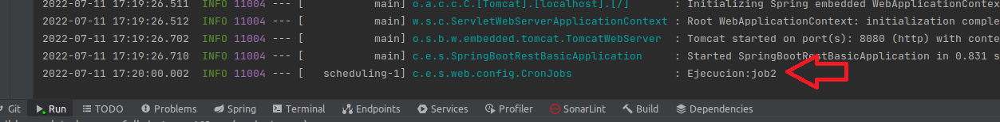

# Descripcion del proyecto:
* Implementacion de ejecuciones cron job en proyecto spring boot

# Contenido del proyecto:
* APP:
    * JDK java 8
    * maven

# Instalacion

1. Ejecutar SpringBoot

# Ejemplo de ejecucion

