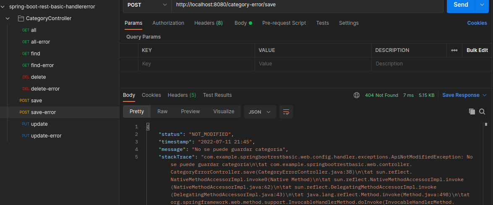

# Descripcion del proyecto:
* Proyecto simple rest con sus anotaciones (get,post,put,delete) y datos dummy para ser consultados
* Ejemplo de implementacion de handler-error(`ControllerAdvice`) en proyecto spring boot

# Contenido del proyecto:
* APP:
    * JDK java 8
    * maven

# Instalacion

1. Ejecutar SpringBoot
2. Postman 

# Ejemplo de ejecucion
