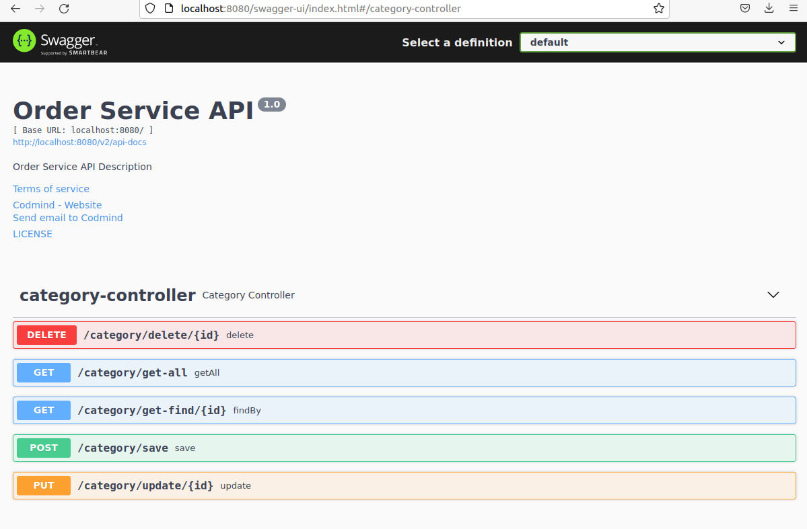

# Descripcion del proyecto:
* Proyecto simple rest con sus anotaciones (get,post,put,delete) y datos dummy para aser consultados
* Implementacion de swagger3 en proyecto spring boot

# Contenido del proyecto:
* APP:
    * JDK java 8
    * maven
    * swagger 3

# Instalacion

1. Ejecutar SpringBoot
2. Abrir navegador y ir a la siguiente url
```
    API: http://localhost:8080/v2/api-docs
    WEB: http://localhost:8080//swagger-ui/index.html
```
# Esperable
