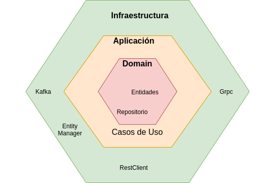

# Ejemplo de proyecto springboot rest con arquitectura hexagonal y spring data jpa

Breve explicacion de la Arquitectura Hexagonal.

* Arquitectura Hexagonal
  * Propone que nuestro dominio sea el núcleo de las capas y que este no se acople a nada externo.
  * Busca desacoplar la aplicación por componentes.
  * Los componentes formaran una serie de capas que serán fácilmente conectables entre si mediante puertos y adaptadores
  * Los componentes puedan llegar a ser intercambiables en cualquier nivel.

* Puertos y adaptadores
  * Puertos: (definición de una interfaz pública.)
    * Los puertos son las interfaces que definen la interacción con el exterior y exponen únicamente datos de nuestro dominio.
  * Adaptadores: (especialización de un puerto para un contexto concreto.)
    * Los adaptadores son precisamente la forma de conectar el exterior con los puertos, implementando la comunicación y la conversión de datos entre el dominio y lo que se necesite fuera.

* Representacion




# Descripcion de la Aplicacion ejemplo
La aplicacion se subdivide en 3 capas (application, domain, infrastructure) en donde:

* application contendra los Puertos
  * service - (Primario | Input): 
    * Interfaz que implementan para los servicios domain 
  * repository - (Secundario | OutPut): 
    * Interfaz que implementa para la capa de datos

* domain
  * La capa de negocio 

* infrastructure contendra los adaptadores
  * controller - (Primario | Input): 
    * controller rest
  * repository - (Secundario | OutPut): 
    * implementacion de capa de datos

* Vista global de los packages

# Ejecutar
1. Crear container de posgresql
```
  docker run -p 5432:5432 --name bdpostgres -e POSTGRES_USER=postgres -e POSTGRES_PASSWORD=postgres -e POSTGRES_DB=test -d postgres
```
2. cargar script 
3. Ejecutar spring boot


# Solucion de problemas
* mapstruct-no-property-named-packaging-exists-in-source-parameters
  * https://stackoverflow.com/questions/63034956/mapstruct-no-property-named-packaging-exists-in-source-parameters 

[//]: # (# Referencias:)
[//]: # (* https://www.baeldung.com/hexagonal-architecture-ddd-spring)
[//]: # (* https://betterprogramming.pub/hexagonal-architecture-with-spring-boot-74e93030eba3)
[//]: # (* https://medium.com/@edusalguero/arquitectura-hexagonal-59834bb44b7f)
[//]: # (* https://www.dddcommunity.org/learning-ddd/what_is_ddd/)
[//]: # (* https://refactorizando.com/ejemplo-de-arquitectura-hexagonal/)
[//]: # (* https://www.adictosaltrabajo.com/2019/07/02/capas-cebollas-y-colmenas-arquitecturas-en-el-backend/)

  
  