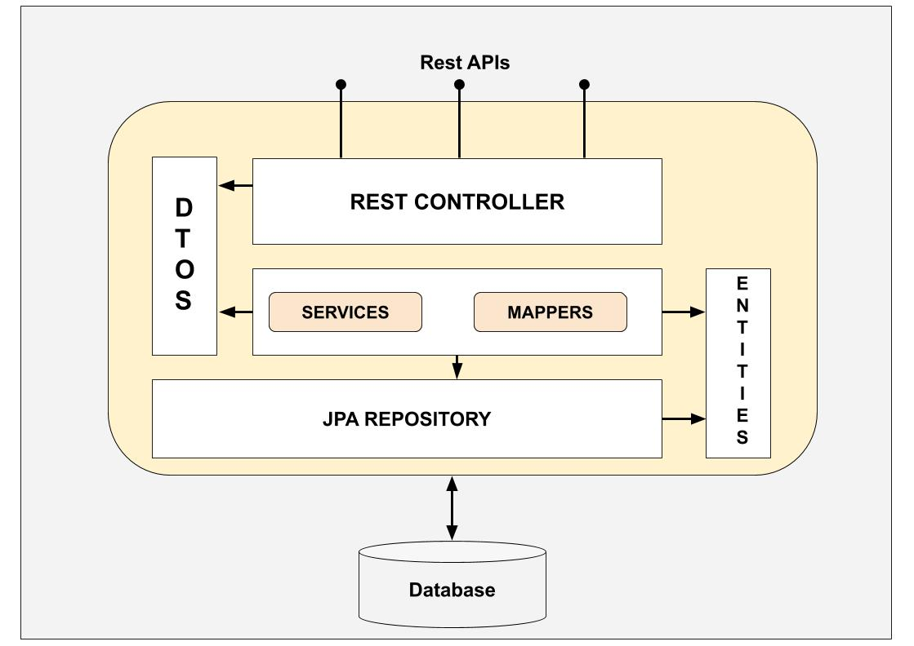

# Descripcion del proyecto:
* Proyecto Spring boot CRUD JPA, conectado a base de datos poscressql

Diagrama de arquitectura que se siguio en el proyecto


# Contenido del proyecto:
* APP:
    * JDK java 8
    * maven
    * swagger 4.5.1
    * Spring profiles
    * Spring Security
    * Autentificacion con JWT
    * Global handler error (`@ControllerAdvice`)
* APP-Test
    * Mockito
* BD:
    * BD - Posgresql
    * Spring JPA data

# Instalacion

1. Crear container de posgresql
```
  docker run -p 5432:5432 --name bdpostgres -e POSTGRES_USER=postgres -e POSTGRES_PASSWORD=postgres -e POSTGRES_DB=test -d postgres
```

2. Revisar que este creada Base datos ``test``
```
  HOST:localhost
  PORT:5432
  DATABASE:test
  USER:postgres
  PASS:postgres
  
```
3. Cargar script [script-demo.sql](sql/script-demo.sql) en BD ``test``
4. Ejecutar SpringBoot
5. swagger
```
    API: http://localhost:8080/api-demo/v2/api-docs
    WEB: http://localhost:8080/api-demo/swagger-ui/index.html
```
6. Postman [spring-boot-rest-crud-jpa-posgres.postman_collection.json](postman/spring-boot-rest-crud-jpa-posgres.postman_collection.json)
